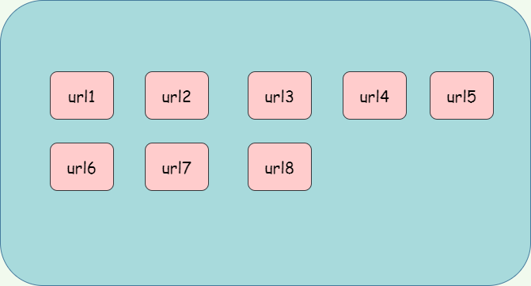
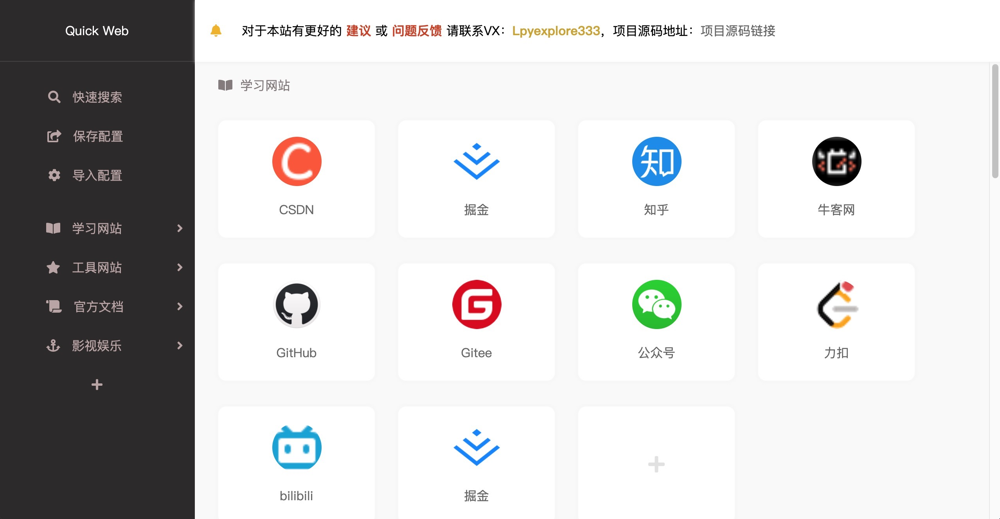
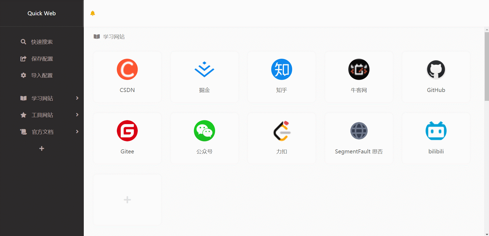

# nav-url（网址导航栏）
A nav web for urls, which based Vue3
通过Vue3框架实现的一个网址导航栏网站

# Original intention of design（设计初衷）

There are many social networking sites and tool websites on the Internet now. If I think the website is not bad, I will collect it. However, the favorite of the browser is too messy and very small, so it is very inconvenient to use. At the same time, because I love to organize things, I always want to have a website navigation bar similar to Figure 1. To sum up the above reasons, and because Vue3 has just been released in recent months, we have made such a project with `Vue3`

现在的互联网上有很多社交网站、工具网站，如果觉得网站还不错，我会把它收藏起来，但是浏览器的收藏夹实在太杂乱了，而且特别小，所以用起来特别得不方便，同时因为我爱整理东西，所以一直想有个类似 **图1** 的网站导航栏。综合上述原因，再加上Vue3近几个月刚发布，就用 `Vue3` 做了这样一个项目

图1：设想图

该图是我该项目当前的预览图

以下两张图是该项目一些基本操作

# Characteristics（特色）

### 中文

1. 通过最新的 `Vue3` 框架实现，同时也用到了 `Vuex4` 进行数据的状态管理
2. 无需远程服务器储存，依靠 `localstorage` 作为本地数据库
3. 支持**一键保存导出数据** 、**一键导入数据**
4. 页面简单大方
5. 内部嵌入了独立接口用于自动获取目标网站的 `icon` 图标
6. 项目中用 `Vue3 API` 封装了 `button` 、`input` 、`dialog` 、 `popover` 、 `message` 组件 
7. 支持URL搜索功能
8. 页面滚动动画
9. 在编辑状态下，可以进行拖拽排列
10. 按照项目功能进行代码抽离，便于项目的维护、迭代、管理

### English
1. Implemented by the latest `Vue3` and `Vuex4`
2. Rely on `localstorage` as a local database,  without remote server storage
3. Support **saving export data with one key** and **importing data with one key**
4. The page is simple and generous
5. An independent interface is embedded inside to automatically acquire the `icon` icon of the target website
6. In the project, `button`, `input`, `dialog`, `popover` and `message` components are encapsulated with `vue3 API`
7. Support URL search function
8. Page scrolling animation
9. In editing state, you can drag and drop to arrange
10. Code extraction according to project functions is convenient for project maintenance, iteration and management

# Schedule（进度）

### 中文

还有一些未完善的功能，会陆续完成：
1. 页面账号信息存储
2. 更多的常用网站图标供用户选择
3. 支持更丰富的搜索规则，便于用户搜索
4. ……更多

### English
There are still some imperfect functions that will be completed one after another:

1. Page account information storage
2. More common website icons for users to choose
3. Support more abundant search rules for users to search
4. ……more

# Use（使用）

### 中文

1. 可以访问这个地址：[http://lpyexplore.gitee.io/nav-infos/](http://lpyexplore.gitee.io/nav-infos/)
2. 将该网址设置成浏览器每次打开默认的地址

### English

1. You can access this address: [http://lpyexplore.gitee.io/nav-infos/](http://lpyexplore.gitee.io/nav-infos/)
2. Set the URL as the default address for every browser opening

# Version（版本）

- **0.1.0 :** 

1. 项目第一次发布（涵盖特色：1 ～ 8）

- **0.1.1 :** 

1. 增加 `特色9`，在编辑状态下支持手动拖拽排列

- **0.1.2 :** 

1. 修复了搜索框无法弹出的bug

- **0.1.3 :**

1. 修复了拖拽排列后id顺序打乱而导致新添加的url框的id不唯一

- **0.1.4：**

1. 对标签页的图标选择页面进行了下拉加载更多
2. 对左侧标签点击主页面的滚动动画做了优化

# The end（最后）

Welcome everyone to give me more advice
欢迎大家给我多提提意见，可加我微信：`Lpyexplore333`，或在 `github` 上提 **Issues**